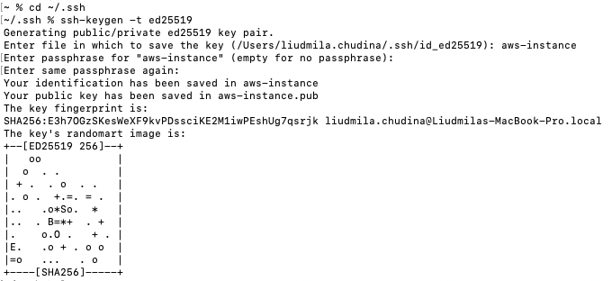

### Option 1: Create Key Pair While Launching EC2 Instance

Steps:

1. Go to EC2 → Launch Instance.  During the set-up AWS asks for: Key Pair (login).
2. Click “Create new key pair”, as an example choose:
    - Name: `my-aws-key` (you can name it in any way)
    - Key pair type: `ED25519` (recommended) or RSA
    - Private key file format: `.pem` (Mac/Linux)
3. Click: Create key pair

This is what happens:

- AWS stores the PUBLIC key (inside your Key Pairs). AWS can now use this public key for EC2 authentication.
- Your browser downloads the PRIVATE key to your Downloads directory (folder) on your Mac.
    - If you `ls` into your `~/Downloads` directory, you will find your PRIVATE key there. It will look like `my-aws-key.pem`

### Option 2: Create Key Pair in AWS BEFORE Creating EC2

If you select Key Pair from the menu column under the EC2 → Network & Security topic. You can choose to create a new Key Pair there, follow the same steps. The same outcome, PUBLIC key gets stored on AWS, and PRIVATE key (which ends in .pem) gets stored on your Downloads directory on your Mac. 

**Remember: AWS never stores your private .pem file. Only you have it.**  

- AWS stores the Public key
- Your Mac stores the Private key (.pem)

#### NOTE: Advisement

It is advised to move your private key from `~/Downloads/` directory to your `~./ssh/` directory for security purposes - it is the standard SSH location on Mac/Linux. You should already have that directory, if not create it - `mkdir -p ~/.ssh` Then move your key. 

Example: `mv ~/Downloads/my-aws-key.pem ~/.ssh/` 

Once you `cd` into your `.ssh` directory, run the command `chmod 400 ~/.ssh/my-aws-key.pem` , this gives secure permissions, without this, SSH may refuse the key.

#### Connecting to your EC2 from your local machine

In your AWS, make sure your EC2 instance is Running. Obtain the Public IP address (note, the address will have periods between the numbers, not dashes. Dashes is for IP DNS name). 

Example of public ip: `3.145.22.100`

Make sure you correct the permissions. Say you are working with `my-key.pem` 

Run: `chmod 400 ~/.ssh/my-key.pem`

SSH into EC2: `ssh -i ~/.ssh/my-key.pem ec2-user@PUBLIC_IP` or

 `ssh -i ~/.ssh/my-aws-key.pem ec2-user@3.145.22.100` 

- First time SSH Message: “The authenticity of host can’t be established…”
    - Type: yes
    - And, you should be in.

#### Option 3: Create SSH Key Pair on YOUR COMPUTER FIRST

- Instead of AWS generating the key, you generate it locally in your Terminal.
- To generate the Key on Mac/Linux - there are several key types.
    
    `ssh-keygen -t ed25519` OR `ssh-keygen -t rsa` 
    
    Options: 
    
    - `ssh-keygen -t ed25519 -C "email"`  - optional label/comment (-C stands for comment). This can be either your email or label or anything you want. Or you can skip the label and name the file. See below examples.
    - `ssh-keygen -t rsa -b 4096` - RSA key size
        - 2048 Good security/Faster Speed/Older standard
        - 3072 Better security/Slightly slower/Modern default
        - 4096 Very strong security/Slightly slower/Common recommendation

For Example:  In my `~/.ssh` directory, I run `ssh-keygen -t ed25519`

Terminal Message: 

% Generating public/private ed25519 key pair. 

Here, I DO NOT enter 3 times, but instead, first I give it a name, for example:

% Enter file in which to save the key (Users/YourName/.ssh/id_ed25519): 

Here I enter:  aws-instance 

- otherwise it will not get saved as id_ed25519, but as aws-instance

Then for the next 2 lines when asking you for a passphrase, just hit enter key twice, to bypass it. It should look something like this:

Now, I run the command `ls` and I see my two keys OR rather my 2 files which I named by aws-instance, that contain the keys - one file with the private key and another file with the public key.

- aws-instance (with the secret key)
- aws-instance.pub (with the public/shareable key)

#### Good to Know:

1. Remember, your keys are stored in files, even though we call them keys. But those files contain your keys (keys are a lines of encrypted text). 
2. In the example above, note that our private key doesn’t have a `.pem` at the end. That’s because Linux/macOS SSH tools traditionally DO NOT require extensions.  
3. When AWS creates a key pair, it intentionally gives it a `.pem` format (easier for compatibility and common for cloud providers). 
4. How does SSH know?
    1. The ED25519 private keys start like this
        
        `---BEGIN OPENSSH PRIVATE KEY-----`
        
    2. The PEM-style (RSA) private keys start like this
        
        `----BEGIN RSA PRIVATE KEY-----`
        
    3. The ED25519 public keys start like this
        
        `ssh-ed25519 AAAAC3Nza....`
        
        And it will end with the file name or email or any other extension if you gave it any at the creation. Also, ED25519 public keys are shorter in length compared to RSA public keys.
        
    4. The RSA public keys start like this
        
        `ssh-rsa AAAAB3Nz...` These can also end with a file name or email or any other extension if it was given at the creation. Also, RSA public keys are longer in length compared to ED25519 public keys. 
        
5. You can also rename the private keys - with or without the .pem extension. Ex: from aws-instance to aws-instance.pem if easier for you to know that it’s a file containing a key, using the `mv` command. However, I personally would keep it AS IS.  If it contains a  .pem extension, you’ll know right away that it was created initially in AWS and not on your computer. Thus the public keys of those keys ending in .pem aren’t on your computer at all, you’ll notice. 
6. Why 2 keys?  
    1. Private key - stays on your computer / secret / used to authenticate
    2. Public key - safe to upload to AWS/GitHub/Linux servers etx.
    
    **Public key is the lock, and Private key is your key to the lock.**
    
    **Remember: For Good practice -** 
    
    **On your local machine, store your public/private keys (files) in your .SSH directory. Just like the cloud stores the public keys in its .ssh directory, in the file called authorized_keys.**

### How to use Your Own Key in AWS

Option 1: 

Say you created key pairs in your local machine. And, you named them: 

`aws-key` and `aws-key.pub`

1. Go to  EC2 Console → Key Pairs
2. Click on Import Key Pair
3. Give it a name - `my-local-key` for example
    1. You don’t have to add .pub at the end, AWS already knows you’re giving it your public key, and not your private key, right? 🙂 
4. Since it’s an absolute path run this command from anywhere, 
    
    `cat ~/.ssh/my-local-key.pub`
    
    - This will show you the key - the entire output.
    - Do not worry that you are copying and pasting - this is normal, and safe. You’re not copying your private key, but the public key.
5. Paste the public key contents into the text box, and click Import Key Pair. 

That’s it. When you are ready to create an EC2 instance, you can select this ‘existing’ key from your Key Pair selections.

(to be continued)